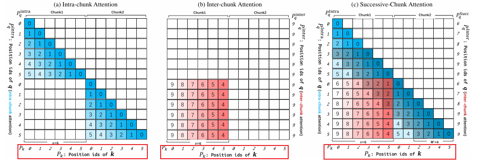
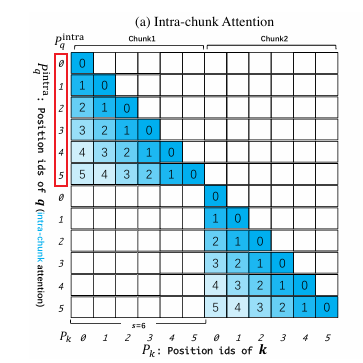
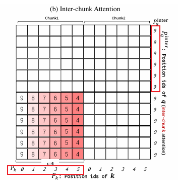
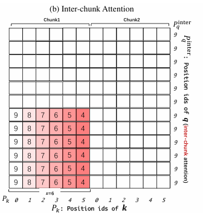
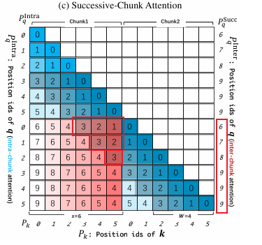
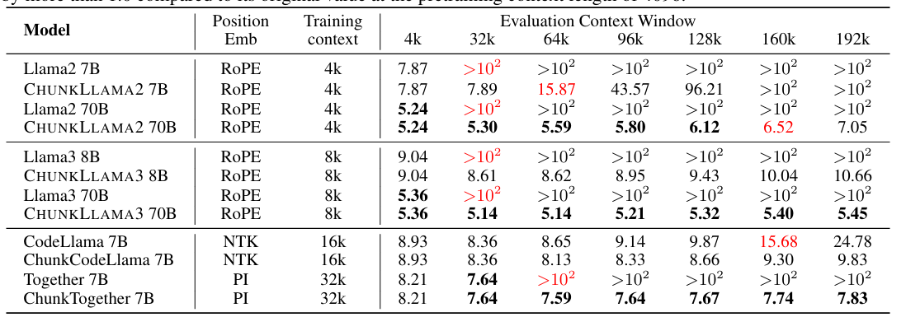
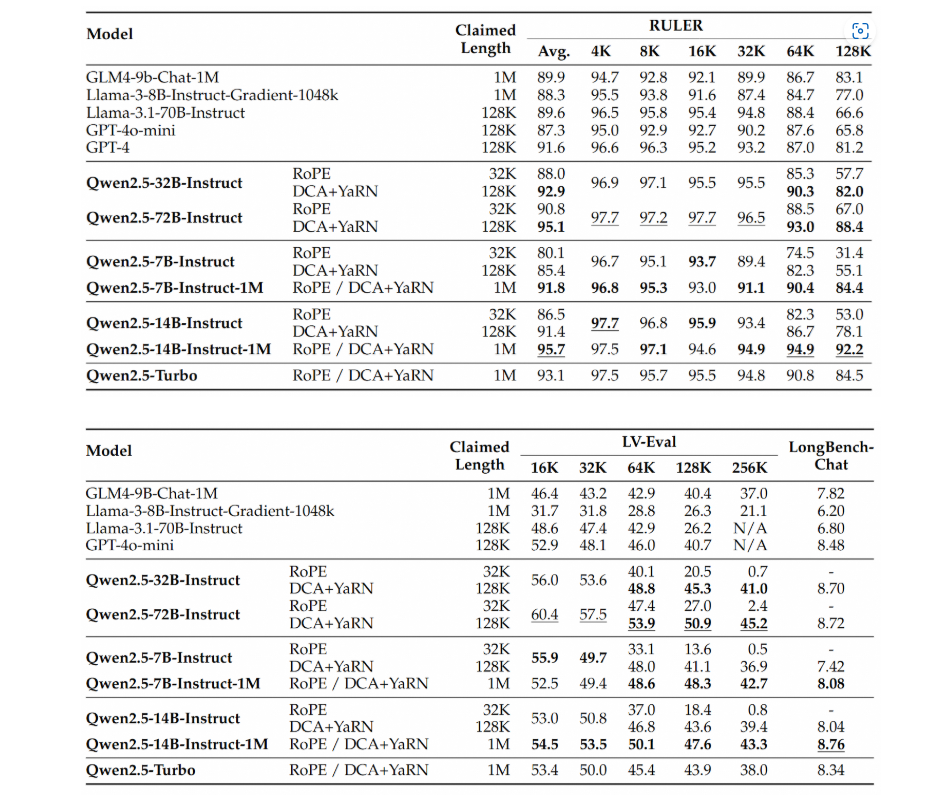

# 简介

Dense Attention的计算受制于显存开销和平方级的时间复杂度，导致大模型训练的上下文窗口无法一直扩展下去，这一限制也催生出了很多上下文长度外推算法。长度外推算法的目的是：使模型能够在推理阶段能够突破模型的训练长度， 并在超出训练窗口的上下文长度上表现良好。目前LLM应用比较广泛的长度外推技术，基本都是基于RoPE (旋转位置编码)衍生出的变体算法，RoPE天然支持相对位置，在长度外推能力上优于传统的绝对位置编码。目前RoPE也是主流大模型(Llama、Qwen、DeepSeek等)的标准配置。

本篇文章介绍Qwen技术团队提出的长度外推算法：Dual Chunk Attention（DCA），根据qwen2.5的技术报告，应用DCA算法可将qwen2.5的上下文长度从256k扩展到1M。[论文地址](https://arxiv.org/abs/2402.17463)

*信息来源：Qwen2.5-1M Technical Report*

*文字来源：Qwen3-235B-A22B-Thinking-2507 huggingFace*

**Dual Chunk Attention (DCA)** 是一种**无需额外训练 (Training-Free)** 就可直接适应超出训练窗口的长上下文的方法，旨在将大型语言模型 (LLM) 的上下文窗口从256k扩展到1M（qwen2.5），而无需进行长上下文训练 (Continual Training)。

该方法具有重要的实际意义，因为它创新解决了 LLM 在处理超过预训练长度的文本时生成的连贯性问题，同时避免了微调 (Fine-tuning) 大模型所需的昂贵计算开销。

# 核心机制

上面提到，RoPE因其表示相对位置特性，可用于长度外推，但RoPE的相对位置表示依赖于训练长度范围内的旋转角度分布，当训练数据的旋转分布无法覆盖扩展上下文的旋转角度时，位置相对关系失真，模型的生成质量暴跌。DCA在RoPE的基础上，提出将长序列等分为长度 <= 训练长度的chunk块，以此将每个chunk内的位置映射到训练分布中；同时对不同chunk间也建立相对位置编码，捕捉chunk间的位置相对关系（仍保证在训练分布内），以解决相对位置不在训练分布中导致关系失真的问题。最终的注意力矩阵由块内注意力和块间注意力叠加而成。

具体来说，DCA按chunk粒度将原始Attention分割成了三种attention类型，下面以例子来说明这三种attention。在例子中，假设训练长度是10，chunk长度是6, local_window长度为4 。local_window的意义在后续章节中说明。Attention算法的位置编码是同时应用于Q、K矩阵的。DCA中对Q、K矩阵的位置编码策略不同。下面详细介绍。

**在DCA算法中，K矩阵的位置编码始终是chunk内编码，假设当前k序列长度为18，分为3个chunk，k序列的每个chunk内位置编码为 0~5**：

*图 片来源：Dual Chunk Attention 论文，用数字来代表相对位置或位置编码。*

下面叙述的是DCA算法中 Q矩阵的位置编码策略。

### **1. Chunk 内注意力（Intra-Chunk Attention）**

关注同一个 Chunk 内部 token 之间的关系。由于 Chunk 的长度通常设定为模型预训练时的窗口大小（或更小），计算 Chunk 内部注意力时，相对位置索引完全落在模型预训练的分布范围内。这保证了模型对局部上下文的理解能力与预训练时保持一致。如下图所示，当chunk大小为6时，Q chunk的intra_chunk位置编码为0~5：

### **2. Chunk 间注意力（Inter-Chunk Attention， 非连续chunk）**

Inter-Chunk关注非连续 Chunk 之间 token 的关系（非连续指的是Q矩阵chunk相对于当前计算的K矩阵的chunk之间的位置关系，例如： Q_chunk3 计算其和K_chunk1之间的注意力分数，Q_chunk3相对于K_chunk1是非连续chunk，此章节讨论的就是在Q_chunk3计算和K_chunk1的注意力分数时，Q_chunk3如何编码）。由于通常chunk大小与预训练长度接近，对于非连续chunk之间的距离，可以简单地将其统一认为长距离位置关系（已远超原训练长度）。为了处理跨 Chunk 的长距离依赖，DCA 并不直接使用绝对位置编码， 依然采用映射到训练分布范围内的相对位置编码来表示token间的长距离关系。

DCA对非连续的chunk使用特殊的位置映射策略：
对于训练长度分布内，模型能捕捉的最大相对位置距离为训练长度train_length，那么为了捕捉长距离依赖，我们需要尽可能为非连续chunk的位置间分配一个尽可能大的相对距离，最简单的方法就是：将非连续的chunk位置编码均编码为train_length - 1。如下图所示, Q_chunk3的inter_chunk位置编码全为9（train_length = 10）:

Q_chunk3的位置编码全为9，K_chunk0的位置编码为0~5，相对距离为 4~9（在训练长度范围内尽可能表示大的相对距离）以表示相对长距离。

### **3. 过渡Chunk注意力（Successive-Chunk Attention）**

如果对所有非intra_chunk均采用上一章节的inter块间编码，会导致相邻chunk的位置编码变化比较剧烈，出现上下文割裂的情况， 例如下图：

图中K_chunk1的位置编码为0~5，Q_chunk2的位置编码全为9, 实际Q当前的token序列和K_chunk1的token为邻近关系，但是最小的相对位置距离却为4，这会导致计算注意力时丢失token间的相邻语义关系。

为了解决此问题，DCA提出了**Successive-Chunk Attention，**来解决相邻chunk编码的问题，引入了local_window_size。local_window是为了捕捉连续chunk（Q和K在位置上连续）的相邻部分的注意力，保持其相对位置距离的连续性。具体编码方式如下图所示：

在上图中，K_chunk0的位置编码为0~5， local_window_size = 4, Q_chunk1作为K_chunk0的相邻chunk，其位置编码为 {chunk_size, chunk_size + 1, ..., chunk_size + local_window_size -1, train_length - 1, ..., train_length - 1}, 则K_chunk0末尾与Q_chunk0开头token的相对距离变为了1、2、...（阴影部分为相对距离长度）， 以表示相邻位置。其物理意义为与K_chunk0相邻的local_window_size窗口内，保证其位置编码和K_chunk0的位置编码连续（仍在训练长度分布内），以捕捉token间的连续和局部语义。local_window_size的大小论文中没有给出明确建议，通常取决于你想捕捉连续语义的长度。

对Q矩阵的每个chunk，都计算其与前序K矩阵的注意力。根据Q_chunk相对于K_chunk位置的不同，Q_chunk采用不同的位置编码计算和K_chunk的注意力。计算完所有注意力后，将当前Q_chunk和前序K的注意力进行叠加（DAC的分块计算注意力特性能天然地和flashAttention结合计算），并进行softmax归一化，最终得到注意力得分矩阵。**分块算法实现非常契合当flashAttentionV2的算法（分块并行计算），所以在算子和算法实现上能带来较大的便利。**

## 实践

伪代码如下：

由上述伪代码看出算法大概逻辑是，用三种不同的Q位置编码来计算FlashAttention，算完之后进行归一化处理。

vllm社区（版本0.10.1之前的版本）集成了DCA算法，大致看代码逻辑如下：

## **特性与性能**

1. **无需训练**：DCA 允许现有模型（如 Llama2 70B）直接扩展上下文窗口，无需额外的梯度更新或参数调整，极大降低了长文本模型的部署门槛。
2. **兼容性强**：该方法兼容现有注意机制，可无缝集成 **Flash Attention**，确保推理过程高效且显存占用低，算子融合改造成本低
3. **性能卓越**：
    - 在主要长文本基准测试中，DCA 展现出强大的外推能力。
    - 在实际长文本任务中的表现可与专门经过长文本微调的模型相媲美，甚至更优。
    - 例如，无需训练的 Llama2-70B 模型在大海捞针等任务中，达到了 **GPT-3.5-16k** 约 **94%** 的性能水平，是极具潜力的开源长文本替代方案。
4. **效果测评**：
DCA论文和Qwen2.5-1M的技术报告中对应用DCA算法后的模型效果进行了测评，主要是在大海捞针任务上和RULER、LV-Eval 和 LongbenchChat上进行了测评。

## 其他

虽然通过DCA长度外推后困惑度和大海捞针上表现出色，但是也是避免不了长上下文的腐败问题，大海捞针更加强调的检索能力的验证，实测在总结类的任务上其实表现不了多惊艳，如何在当前的RAG or Agent系统中利用好该算法赋能后的模型检索能力可能是下一步该思考的问题。
