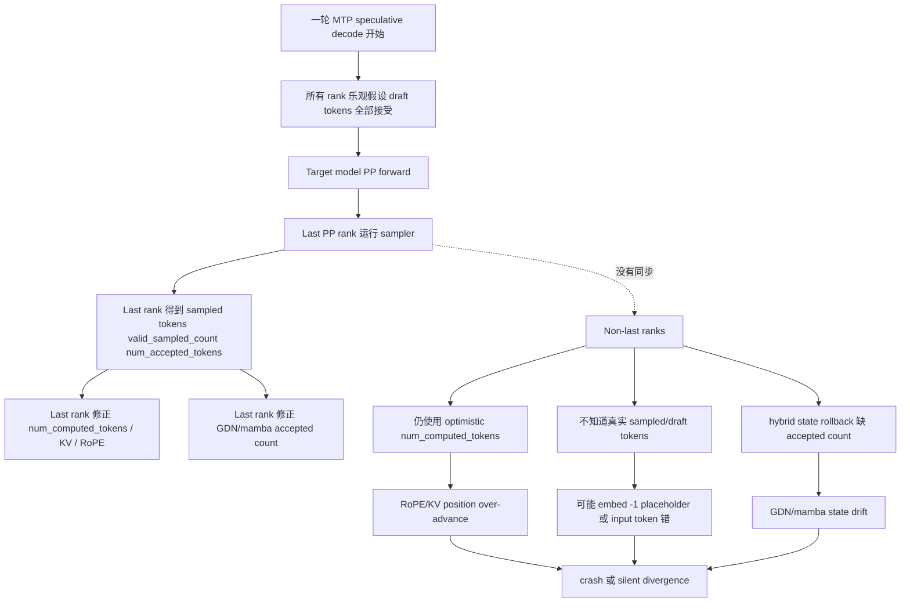
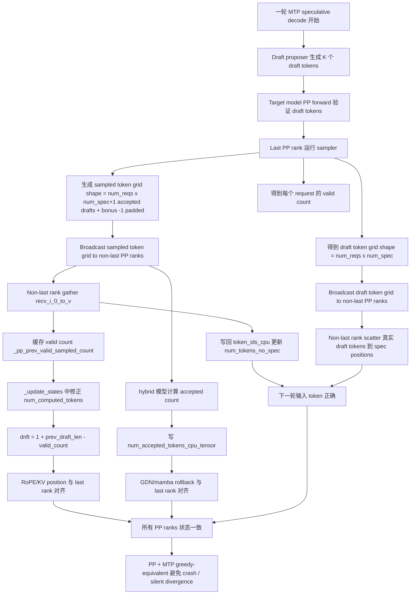
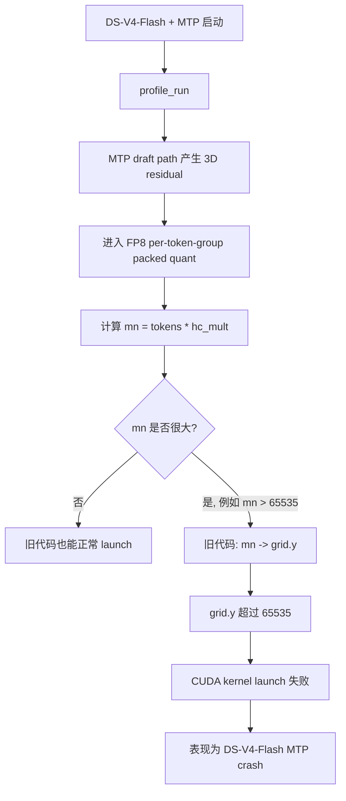
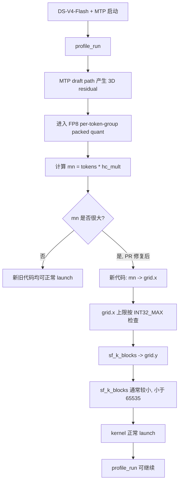
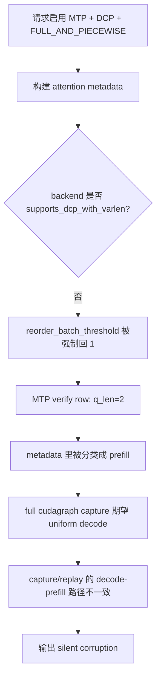
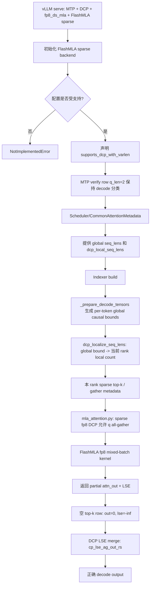
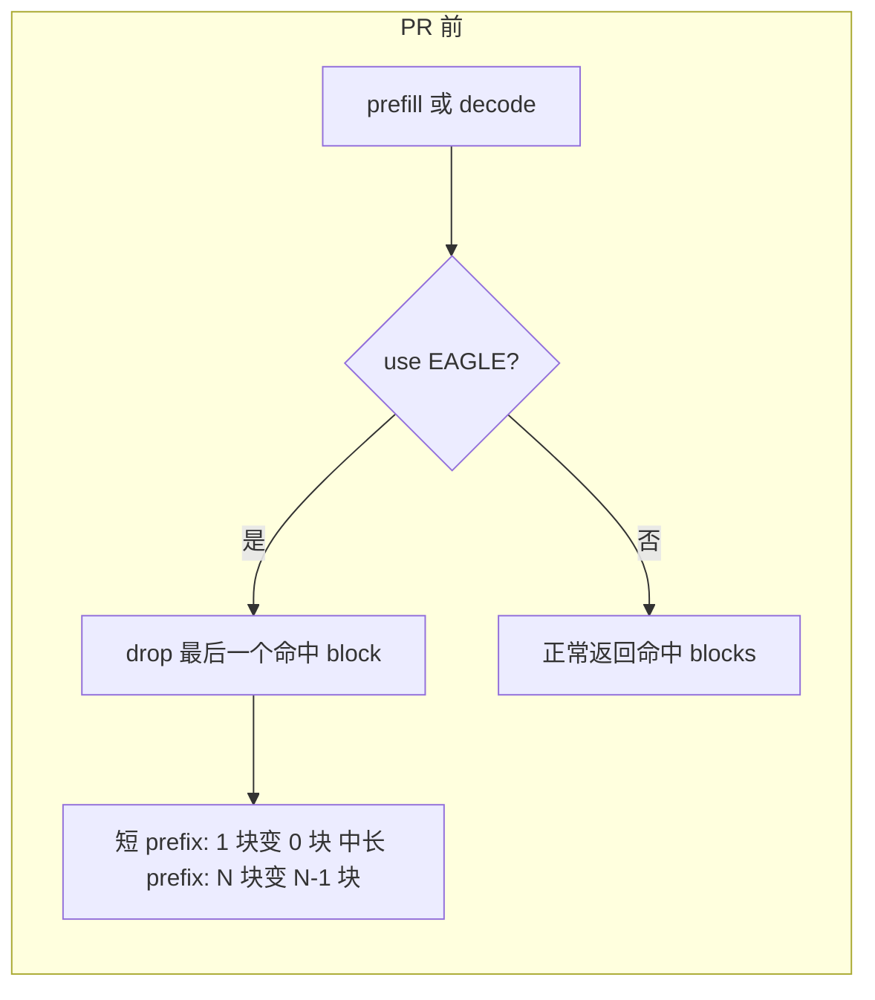
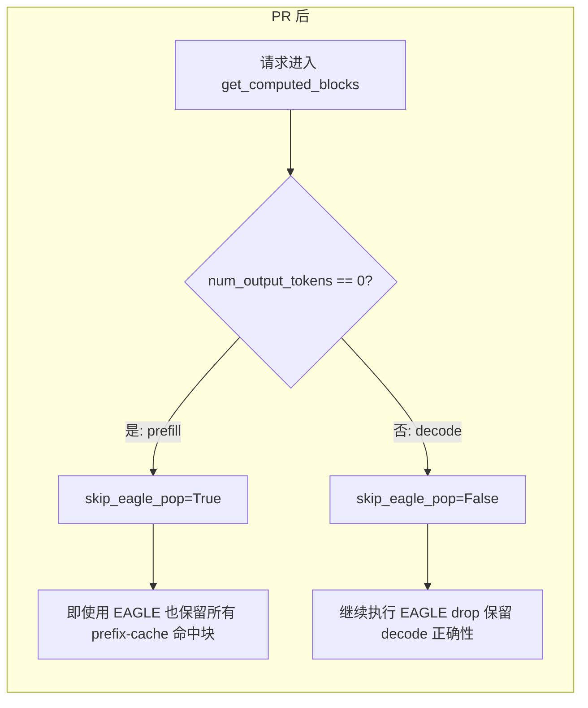
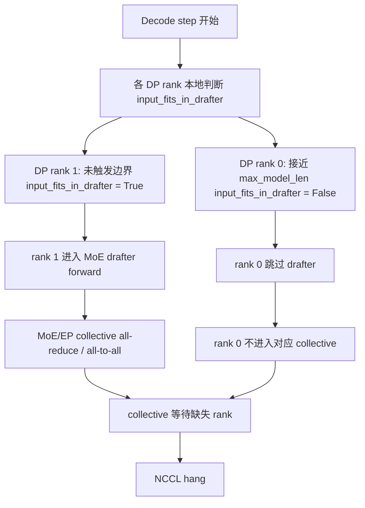
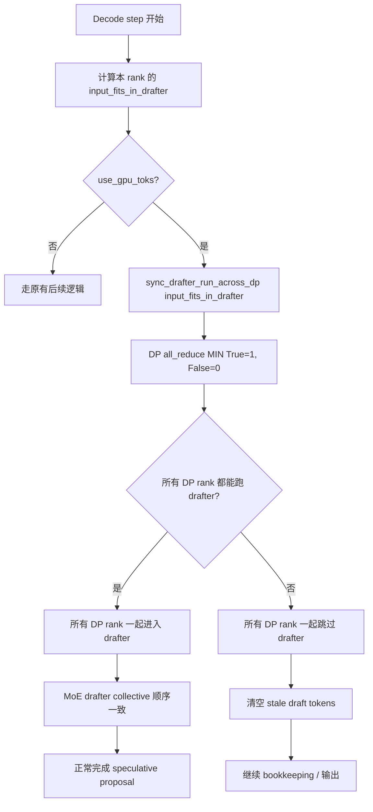

> 截至 2026-06-16

---

## 总览：PR 修复状态一览

| # | Issue | 讨论数 | PR | 状态 | 备注 |
|---|-------|--------|-----|------|------|
| 1 | #44697 MTP + Pipeline Parallelism (PP>1) | 0 | PR #44698 | 🟡 Open, 0 reviews | RFC 质量高, benchmark 充分 |
| 2 | #45099 DS-V4-Flash MTP + DP4 + EP + MegaMoE crash | 1 | PR #45255 | 🟡 Open, 1 review | 根因是 FP8 quant kernel |
| 3 | #45425 MTP + DCP + cudagraph 静默损坏 | 0 | PR #45426 | 🟡 Open, 0 reviews | 仅覆盖 FlashMLA sparse |
| 4 | #44858 MTP + prefix cache 少命中 1 块 | 0 | PR #44986 | 🟡 Open, 0 reviews | prefill 跳过 eagle pop |
| 5 | #44879 compressed-tensors FP8 KV on SM89 crash | 0 | PR #45038 | 🟡 Open, 0 reviews | SM90+ guard |
| 6 | #45445 bad_words Already borrowed RuntimeError | 1 | PR #45522 | 🟡 Open, 0 reviews | 缓存 bad_words tokenization |
| 7 | #44185 DP + MoE draft model 死锁 | 3 | PR #44954 | 🟡 Open, 0 reviews | DP-wide AND 同步 |

---

## 逐条讨论详情

### 1. #44697 — MTP + Pipeline Parallelism (PP>1)

#### Issue

**现象**：MTP speculative decoding 在 PP>1 时，部分配置 crash，部分配置**静默偏离** no-spec greedy baseline（输出不正确但不报错）。

**触发条件**：PP size > 1 + MTP speculative decoding 开启。三类具体后果：
- `num_computed_tokens` correction 被非最后 rank 跳过 → RoPE/KV position over-advance
- hybrid GDN/mamba 的 `num_accepted_tokens` rollback 只在最后 rank 上设置 → state drift
- sampled/draft token 值只在最后 rank 上 → 下一轮 input token 错误

**本质原因**：MTP speculative decoding 每轮先乐观假设 draft tokens 全接受，再根据 sampler 结果修正。但 sampler 只在 last PP rank 运行，修正信息（valid/accepted count）只存在于 last rank，non-last ranks 拿不到，仍按乐观状态推进，导致 KV/RoPE/GDN/mamba/input token 全部漂移。

> 一句话：**last rank 知道"哪些 draft 被接受了"，non-last ranks 不知道，但 non-last ranks 仍继续维护 KV/RoPE/mamba state，于是状态漂移。**

#### PR #44698 — `[Spec][PP] Support MTP speculative decoding under pipeline parallelism (PP>1)`

**修改思路**：把 last rank 的 sampler 结果变成显式 PP contract——广播 sampled token grid、draft token grid、valid/accepted count，让所有 PP ranks 按同一份结果推进状态。

核心 invariant：

> **sampler 产生的 per-request valid/accepted count 必须广播给所有 PP ranks；所有 rank 都按同一份接受结果推进 token、position、KV、GDN/mamba state。**

**改动内容**：

1. **新增 draft PP 解耦配置** — `draft_pipeline_parallel_size`（默认 1），允许 draft model 的 PP size 为 1 或 target PP size；新增 `draft_embed_quant_bits`（4/8 bit），降低大模型 last rank 显存压力。([GitHub][3])

2. **新增 width-agnostic PP broadcast helper** — `pp_spec_broadcast.py`。旧 broadcast 假设 sampled token 是 `[num_reqs, 1]`；但 MTP sampler 产物是 `[num_reqs, num_spec + 1]`，未接受位置用 `-1`。核心公式：
   ```text
   optimistic_advance = 1 + prev_num_draft_len
   true_advance       = valid_sampled_count
   drift_correction   = optimistic_advance - true_advance
   ```
   ([GitHub][4])

3. **last rank 广播 sampled token grid + draft tokens** — 扩展 `gpu_model_runner.py` 中 PP broadcast：last rank 广播 `[num_reqs, num_spec + 1]` sampled token grid（pad `-1`）和 draft token grid，避免 non-last rank 在 spec positions 上使用 `-1` placeholder。([GitHub][5])

4. **non-last rank 重建本地输入状态** — 把 `recv[i, 0:v]` 写回 `token_ids_cpu`，推进 `num_tokens_no_spec`；缓存 valid count 到 `_pp_prev_valid_sampled_count`。([GitHub][5])

5. **non-last rank 修正 `num_computed_tokens`** — 用 broadcast valid count 在 `_update_states` 中从 optimistic `num_computed_tokens` 减掉 rejected draft 数。**这是 correctness fix 的核心。** ([GitHub][5])

6. **hybrid GDN/mamba rollback 同步** — 用 `(recv != -1).sum(dim=1)` 得到 accepted count，写入 `num_accepted_tokens_cpu_tensor`。([GitHub][5])

**改动前流程**：



**改动后流程**：



**改动的效果**：PR 附带完整测试和 benchmark（1.68-1.89x speedup, ~94% acceptance），RFC 质量极高。但 **review comments 为 0**——maintainer 尚未开始 review。

[1]: https://github.com/vllm-project/vllm/issues/44697 "[RFC]: MTP speculative decoding under pipeline parallelism (PP>1) · Issue #44697 · vllm-project/vllm · GitHub"
[2]: https://github.com/vllm-project/vllm/pull/44698 "[Spec][PP] Support MTP speculative decoding under pipeline parallelism (PP>1) by atassis · Pull Request #44698 · vllm-project/vllm · GitHub"
[3]: https://raw.githubusercontent.com/atassis/vllm/feat/mtp-pipeline-parallel-spec-decode/vllm/config/speculative.py "raw.githubusercontent.com"
[4]: https://raw.githubusercontent.com/atassis/vllm/feat/mtp-pipeline-parallel-spec-decode/vllm/v1/worker/pp_spec_broadcast.py "raw.githubusercontent.com"
[5]: https://raw.githubusercontent.com/atassis/vllm/feat/mtp-pipeline-parallel-spec-decode/vllm/v1/worker/gpu_model_runner.py "raw.githubusercontent.com"

---

### 2. #45099 — DeepSeek-V4-Flash MTP + DP4 + EP + MegaMoE crash

#### Issue

**现象**：DeepSeek-V4-Flash 在 DP4 + EP + deep_gemm_mega_moe 下，不开 MTP 可以启动；一旦开启 MTP speculative decoding，**启动阶段 profile_run 就崩**，尚未进入真实请求服务。`num_speculative_tokens=1` 和 3 都会触发，报错 `CUDA error: invalid argument`。

**触发条件**：

```text
--data-parallel-size 4
--enable-expert-parallel
--moe-backend deep_gemm_mega_moe
--kv-cache-dtype fp8
--block-size 256
--max-num-batched-tokens 32768
--attention_config.use_fp4_indexer_cache True
--speculative-config '{"method":"mtp","num_speculative_tokens":1}'
```

**本质原因**：栈上看似 MTP projection 崩了，但这只是异步 CUDA 报错表象。真正根因是底层 **FP8 packed per-token-group quant CUDA kernel 的 grid 维度映射错误**：旧代码把行维度 `mn` 放到 `gridDim.y`，而 CUDA 的 `grid.y` 上限是 `65535`；DeepSeek-V4 MTP draft path 会量化 3D residual，使 `mn = tokens * hc_mult` 在 profile run 中超过该限制，触发 kernel launch 失败。([GitHub][1])

#### PR #45255 — `[Bugfix] Fix gridDim.y overflow for large row counts`

**修改思路**：把大概率很大的 row 维度 `mn` 从 `grid.y`（上限 65535）搬到容量更大的 `grid.x`（上限 INT32_MAX），并把 launch guard 改成符合 CUDA 实际限制。不是改 MTP 逻辑或 DeepSeek-V4 模型代码，而是修底层 FP8 packed quant kernel。

**改动内容**：

1. **核心 bug：大维度放错了轴** — 旧代码 `mn_idx = blockIdx.y * ry + row_local`，新代码 `mn_idx = blockIdx.x * ry + row_local`。同时 `sf_k_idx` 从 `blockIdx.x` 改到 `blockIdx.y`。

   | 逻辑维度 | 旧代码放到 | 问题 | 新代码放到 |
   |----------|-----------|------|-----------|
   | `sf_k` / scale group K | `grid.x` | 安全 | `grid.y` |
   | `mn` / row 方向 | `grid.y` | 可能超过 65535 | `grid.x` |

2. **host launch 参数同步换轴** — `dim3 grid(row_blocks, sf_k_blocks)`，和 kernel 内索引一一对应。

3. **guard 检查修正** — 旧代码错误假设 `grid.x/grid.y` 都可到 `2^31-1`；新代码改成 `row_blocks <= INT32_MAX` 且 `sf_k_blocks <= 65535`。

4. **新增 regression test** — `test_per_token_group_quant_fp8_packed_large_mn`：`num_tokens=65537, hidden_dim=2048, group_size=128`，刚好超过旧实现的 `grid.y=65535` 限制。不带 fix 时复现 `CUDA error: invalid configuration argument`；带 fix 后 120 tests 全 pass。

**改动前流程**：



**改动后流程**：



**改动效果**：修复是"轴交换 + guard 修正 + 单测复现"的完整链。影响所有走 packed FP8 quant kernel 的路径（不只 DS-V4-Flash MTP），但改动是 grid 组织方式，不是量化公式，功能风险偏低。有 1 条 review comment，进展缓慢。建议在 PR 分支上跑原 issue 启动命令确认 profile_run 不再 crash。

[1]: https://github.com/vllm-project/vllm/pull/45255 "[Bugfix] Fix gridDim.y overflow for large row counts by JasonLi314 · Pull Request #45255 · vllm-project/vllm · GitHub"
[2]: https://github.com/vllm-project/vllm/pull/45255/files "[Bugfix] Fix gridDim.y overflow for large row counts · Pull Request #45255 · vllm-project/vllm · GitHub"

---

### 3. #45425 — MTP + DCP + cudagraph 静默输出损坏

#### Issue

**现象**：MTP + DCP + FULL_AND_PIECEWISE cudagraph 组合下，输出**静默损坏**——不是 crash，而是输出截断到 1-2 个字符或进入重复循环。服务日志无 error/warning，看起来健康。

**触发条件**：请求启用 MTP speculative decoding + DCP (decode context parallelism) + FULL_AND_PIECEWISE cudagraph mode + attention backend **没有声明 `supports_dcp_with_varlen`**。

**本质原因**：DCP 下，如果 backend 没声明 `supports_dcp_with_varlen`，`AttentionMetadataBuilder._init_reorder_batch_threshold` 会把 `reorder_batch_threshold` 强制回 1；MTP verify row 的 `q_len=2` 因此在 metadata build 时被归类成 **prefill**；但 full cudagraph capture 假设 uniform spec-decode batch 走 **decode** path，capture/replay 路径不一致，最终不是 crash 而是**输出被静默污染**。([GitHub][1])

> 一句话：**DCP 把 MTP verify row 强制归类成 prefill，但 cudagraph replay 期望它是 decode → metadata 与 capture 不一致 → silent corrupt。**

#### PR #45426 — `[Attention][MLA] FlashMLA sparse: enable DCP on the fp8 mixed-batch path and MTP with full cudagraphs`

**修改思路**：让 FlashMLA sparse + fp8_ds_mla + DCP 走一条完整可闭环的 decode 路径。选择"让 backend 真正支持 DCP varlen decode"（方案 b），而非 init-time reject/downgrade（方案 a）。但仅覆盖 FlashMLA sparse backend。

**改动内容**：

1. **`flashmla_sparse.py`：声明 `supports_dcp_with_varlen`** — 当 `cp_kv_cache_interleave_size == 1` 时声明该能力，让 MTP `q_len=2` 在 DCP 下仍作为 decode。加 init-time guard：拒绝非默认 `a2a` comm backend、非 mixed-batch fp8 path、head padding 不一致等未验证配置。([GitHub][2])

2. **`mla_attention.py`：放开 fp8 + DCP assert** — 从 `assert not fp8_attention` 改成 `assert not fp8_attention or is_sparse_impl`（只允许 sparse MLA 路径）。([GitHub][2])

3. **LSE 返回：DCP merge 必须要它** — 设 `can_return_lse_for_decode=True`，让 `_forward_fp8_kv_mixed_batch` 返回 `(attn_out, lse)`。LSE layout 从 `(B,H,T)` 转 `(T,H)`；空 top-k row（`topk_indices` 全 `-1`）设成 merge identity：`out=0, lse=-inf`。([GitHub][2])

4. **`indexer.py` / `utils.py`：local causal bound** — 把 global causal bound 按 DCP interleaved ownership 转成当前 rank 的 local KV count。核心公式：
   ```python
   ilv = cp_kv_cache_interleave_size
   grp = dcp_world_size * ilv
   full = seq_lens // grp
   rem = seq_lens - full * grp
   extra = (rem - dcp_rank * ilv).clamp_(0, ilv)
   return full * ilv + extra
   ```
   MTP/native decode 展开后逐 token localize，因为 DCP interleaving 下相邻 position 可能属于不同 rank，所以 `localize(L) - k ≠ localize(L - k)`。([GitHub][3])

5. **top-k 语义变化** — DCP 后每个 rank 在自己的 KV shard 上选 top-2048，LSE merge 合并 partial attention，最终 attention support 是"各 rank top-k 的并集"，最多 `dcp_world_size × 2048`，不是严格的 global top-2048。不做跨 rank index exchange，避免 hot path 多一个 collective。([GitHub][4])

**改动前流程**：



**改动后流程**：



**改动效果**：

- DCP=4 + MTP + FULL_AND_PIECEWISE 从 silent corruption 变成 correct
- 单流 decode 从 PIECEWISE workaround 的 54.0 tok/s 提到 full graph 的 81.3 tok/s
- KV pool 从 TP=4 baseline 的 217,664 tokens 提到 DCP=4 的 1,053,184 tokens
- 验证环境：4×H200、GLM-5.1-NVFP4、fp8_ds_mla

**未完全解决**：
- 其他 attention backend 没有 `supports_dcp_with_varlen`，仍可能触发同类 silent corruption——建议补一个全局 guard
- 只覆盖默认 `ag_rs` DCP comm backend，`a2a` 被拒绝
- bf16 sparse path、separate prefill/decode fp8 path 未覆盖

[1]: https://github.com/vllm-project/vllm/issues/45425 "[Bug]: Silent output corruption: MTP + DCP + FULL_AND_PIECEWISE cudagraphs · Issue #45425 · vllm-project/vllm · GitHub"
[2]: https://github.com/vllm-project/vllm/pull/45426/files "[Attention][MLA] FlashMLA sparse: enable DCP · Pull Request #45426 · vllm-project/vllm · GitHub"
[3]: https://github.com/vllm-project/vllm/pull/45426/commits/1feba113175be2595a218a834ed684b8289db8d5 "[Attention][MLA] FlashMLA sparse: enable DCP · Commits · vllm-project/vllm · GitHub"
[4]: https://github.com/vllm-project/vllm/pull/45426 "[Attention][MLA] FlashMLA sparse: enable DCP · Pull Request #45426 · vllm-project/vllm · GitHub"

---

### 4. #44858 — MTP + prefix cache 少命中 1 块

#### Issue

**现象**：EAGLE/MTP 打开后，vLLM prefix cache 命中比不开时**少 1 个 block**。短 prompt 场景（如 2000 tokens、80% 重复、block_size=1536）从"命中 1 块"退化成"命中 0 块"（prefix cache 0%）。

**触发条件**：EAGLE/MTP speculative decoding 开启 + prefix caching 开启。短 prompt 时 1 块变 0 块（完全 miss）；中长 prompt 时 N 块变 N-1 块（额外重算 1 个 block = block_size tokens）。

**本质原因**：vLLM 为了让 EAGLE/MTP draft head 拿到"当前步新算出来的 hidden states"，**故意把 prefix-cache 命中的最后一个 block 弹掉**（`computed_blocks.pop()`），让主模型重新算这一块，从而产生 draft head 需要的 hidden states。

这个策略对 **decode** 合理（draft tokens 确实需要 hidden states），但对 **prefill** 不合理——prefill 还没有 draft tokens，没必要为 EAGLE 把最后一个 block 丢掉。issue #44858 就是 prefill 阶段也被无差别弹掉 1 block。

> 一句话：**EAGLE/MTP 开启后少 1 个 prefix-cache block，不是 cache 没命中，而是命中后为了获得 draft head 需要的 hidden states，主动把最后一个 block pop 掉并强制重算。这个策略 decode 合理，prefill 不合理。**

#### PR #44986 — `[Core][Eagle] Fix prefix cache efficiency in prefill phase`

**修改思路**：给 prefix-cache 查找链路加一个开关——**prefill 阶段跳过 EAGLE 的"pop last block"，decode 阶段保持原有 pop 行为**。

核心判断：`num_output_tokens == 0 → prefill → skip_eagle_pop=True`；`num_output_tokens > 0 → decode → skip_eagle_pop=False`。

**改动内容**：

1. **`KVCacheManager.get_computed_blocks()`** — 新增 `is_prefill_phase = request.num_output_tokens == 0`，传 `skip_eagle_pop=is_prefill_phase` 给 coordinator。([GitHub][2])

2. **`UnitaryKVCacheCoordinator.find_longest_cache_hit()`** — 把 `drop_eagle_block` 条件改成 `(0 in self.eagle_group_ids) and (not skip_eagle_pop)`。([GitHub][3])

3. **`HybridKVCacheCoordinator.find_longest_cache_hit()`** — 把 `drop_eagle_block` 条件改成 `use_eagle and (idx not in eagle_verified) and (not skip_eagle_pop)`。([GitHub][3])

4. **新增测试** — 覆盖 prefill 保留 blocks、decode 继续 drop、长输入、hybrid 模型路径。

**改动前流程**：



**改动后流程**：



**改动效果**：

- Prefill 阶段不再丢失最后一个 prefix-cache block → 短 prompt 场景从 0% 恢复到正常命中率
- Decode 阶段行为不变 → EAGLE draft head 仍能拿到需要的 hidden states
- PR 标题提到 Eagle，说明修复同时覆盖 EAGLE 和 MTP 的 prefix cache 效率问题
- 有 5 条 PR 讨论但 0 条 formal review

[1]: https://github.com/vllm-project/vllm/issues/44858 "[Performance]: After enabling MTP, the number of hit blocks for prefix cache is one less · Issue #44858 · vllm-project/vllm · GitHub"
[2]: https://raw.githubusercontent.com/fanshuxue-hw/vllm/fix-eagle-prefix-cache-prefill/vllm/v1/core/kv_cache_manager.py "raw.githubusercontent.com"
[3]: https://raw.githubusercontent.com/fanshuxue-hw/vllm/fix-eagle-prefix-cache-prefill/vllm/v1/core/kv_cache_coordinator.py "raw.githubusercontent.com"
[4]: https://raw.githubusercontent.com/fanshuxue-hw/vllm/fix-eagle-prefix-cache-prefill/tests/v1/core/test_eagle_prefix_cache.py "raw.githubusercontent.com"

---

### 5. #44879 — compressed-tensors FP8 KV on SM89 crash

#### Issue

**现象**：在 SM89 GPU（L4 / RTX 4090）上使用 compressed-tensors FP8 KV cache 时 crash。

**触发条件**：SM89 GPU + compressed-tensors FP8 KV cache + vLLM serving。

**本质原因**：compressed-tensors FP8 KV cache override 只应在 SM90+ GPU 上生效（需要 FlashInfer FP8 kernel 支持），但代码缺少对 SM90+ 的 guard，在 SM89 上错误启用，导致 FlashInfer kernel 缺失并 crash。Issue 分析精确定位到代码行。([GitHub][1])

#### PR #45038 — `[Bugfix] Guard compressed-tensors FP8 KV cache override on SM90+`

**修改思路**：在 compressed-tensors FP8 KV cache override 路径上加 SM90+ guard，阻止在 SM89 及以下 GPU 上错误启用。

**改动内容**：
- 在 compressed-tensors 配置检查中新增 GPU compute capability 判断，只在 SM90+ 时允许 FP8 KV cache override

**改动前流程**：compressed-tensors FP8 KV cache override 在所有 GPU 上启用 → SM89 上 FlashInfer kernel 缺失 → crash。

**改动后流程**：override 仅在 SM90+ 上启用 → SM89 上回退到 bf16 KV cache → 不 crash。

**改动效果**：修复方向正确且简单。SM89 (L4/RTX 4090) 是广泛使用的 GPU，这个 fix 应优先 review。0 条 formal review。

[1]: https://github.com/vllm-project/vllm/pull/45038 "[Bugfix] Guard compressed-tensors FP8 KV cache override on SM90+ · Pull Request #45038 · vllm-project/vllm · GitHub"

---

### 6. #45445 — bad_words `Already borrowed` RuntimeError

#### Issue

**现象**：启用 bad_words tokenizer 时，并发请求触发 `RuntimeError: Already borrowed`。

**触发条件**：vLLM serving + bad_words 配置 + 并发请求。

**本质原因**：`bad_words` 的 tokenization 在每次请求时重新计算，但 Rust-based tokenizer（如 HuggingFace tokenizers）的并发 borrow 机制不允许同一 tokenizer 对象被多个线程同时使用。每次请求都重新 tokenize bad_words 导致 borrow 冲突。Issue 中验证了缓存 bad_words tokenization 的 workaround 有效。

**讨论**：@littlecircle0730 认领了修复工作。([GitHub][1])

#### PR #45522 — `fix: cache bad_words tokenization to avoid 'Already borrowed' errors under concurrency`

**修改思路**：缓存 bad_words 的 tokenization 结果，避免每次请求重新 tokenize，从而消除并发 borrow 冲突。

**改动内容**：
- 缓存 bad_words tokenization 到 tokenizer 初始化阶段
- 并发请求直接使用缓存结果，不再触发 Rust tokenizer borrow

**改动前流程**：每次请求都 tokenize bad_words → Rust tokenizer 并发 borrow → RuntimeError。

**改动后流程**：初始化时一次性 tokenize bad_words 并缓存 → 并发请求直接读取缓存 → 无 borrow 冲突。

**改动效果**：修复方案与 issue 中验证过的 workaround 一致。0 条 formal review。

[1]: https://github.com/vllm-project/vllm/pull/45522 "fix: cache bad_words tokenization · Pull Request #45522 · vllm-project/vllm · GitHub"

---

### 7. #44185 — DP + MoE draft model 死锁

#### Issue

**现象**：vLLM 在 DP + MoE draft model / EP + MTP speculative decoding 下**永久 hang**（不 crash，不报错，服务器无响应）。

**触发条件**：
```text
--data-parallel-size 2
--enable-expert-parallel
--speculative-config '{"method":"mtp",...}'
请求长度接近 max_model_len
```

**本质原因**：DP ranks 对"是否进入 drafter/speculative path"的判断不一致——请求接近 `max_model_len` 时，某个 DP rank 的 `input_fits_in_drafter=False` 跳过 drafter；另一个 rank 仍进入 MoE drafter forward。MoE/EP 路径里有 collective communication（all-reduce/all-to-all），一边进 collective、一边不进，造成 NCCL collective 序列失配，永久等待。([GitHub][3])

> 一句话：**`input_fits_in_drafter` 是 local decision，但 drafter forward 里有 cross-rank collective → 控制流分歧导致集体通信序列失配 → 永久 hang。**

#### PR #44954 — `Fix DP drafter hang near max model length`

**修改思路**：把"是否进入 drafter"从 local branch 提升成 **DP-wide branch**——所有 DP rank 必须同进同退。实现方式：`sync_drafter_run_across_dp()`，用 `dist.all_reduce(tensor, op=MIN, group=dp_group)` 做 DP-wide AND（True=1, False=0），只有所有 rank 都认为可以跑 drafter 才跑，否则全部跳过。

**改动内容**：

1. **新增 `sync_drafter_run_across_dp`** — `dp_utils.py` 新增 17 行。`data_parallel_size == 1` 时直接返回本地决策；否则构造 int32 tensor 做 DP all_reduce MIN。([GitHub][2])

2. **真实请求路径** — `gpu_model_runner.py` 在 `use_gpu_toks` 路径下，把本地 `input_fits_in_drafter` 先交给 `sync_drafter_run_across_dp()` 同步，再决定是否调用 `propose_draft_token_ids()`。([GitHub][4])

3. **dummy run 路径** — `_dummy_run()` 也加同一个 DP 同步，避免 dummy rank 在真实 rank 已跳过 drafter 时继续跑 dummy drafter，把 collective 顺序搞乱。([GitHub][4])

**改动前流程**：



**改动后流程**：



**改动效果**：
- 修复 near `max_model_len` 的 hang（范围窄但命中后 server 永久无响应）
- vllm-ascend fork 已先行修复（PR #10117, #10112），vLLM main 的 PR 等待 review
- Review 关注点：性能开销（每步多一次 DP all-reduce）、覆盖范围（只挂在 `use_gpu_toks` 和 dummy path）、测试不足（需 regression test 覆盖 DP=2 + EP + MTP + near max_model_len）

[1]: https://github.com/vllm-project/vllm/pull/44954/files "Fix DP drafter hang near max model length · Pull Request #44954 · vllm-project/vllm · GitHub"
[2]: https://github.com/venjii13/vllm/blob/fix-mtp-dp-drafter-hang/vllm/v1/worker/dp_utils.py "dp_utils.py · vllm-project/vllm · GitHub"
[3]: https://github.com/vllm-project/vllm/issues/44185 "[Bug]: vLLM hangs during speculative decoding with MoE draft model near max_model_len under DP · Issue #44185 · vllm-project/vllm · GitHub"
[4]: https://github.com/benjii13/vllm/raw/refs/heads/fix-mtp-dp-drafter-hang/vllm/v1/worker/gpu_model_runner.py "raw.githubusercontent.com"
[5]: https://github.com/vllm-project/vllm/pull/44954 "Fix DP drafter hang near max model length · Pull Request #44954 · vllm-project/vllm · GitHub"

---

## 综合评估

### PR 进展统计

| 状态 | 数量 | 说明 |
|------|------|------|
| 有 PR，Open | **7** | 全部等待 review |
| 有 PR，Merged | **0** | 本月无任何 PR 被 merge |
| 即将有 PR | 0 | — |

### 关键瓶颈

1. **Review 瓶颈**：7 个 Open PR 中，**6 个有 0 条 formal review**。仅有 #45255（1 review）有 review 活动。Maintainer review bandwidth 是最大瓶颈。

2. **0 Merge**：6 月份已过半月，没有任何修复 PR 被 merge。所有已知 bug 仍存在于 main 分支。

3. **高危 bug 无修复**：
   - #45425（MTP+DCP 静默损坏）：PR 仅覆盖 FlashMLA sparse backend，其他 backend 仍无防护
   - #44858（prefix cache 少 1 块）：prefill 阶段性能退化，短 prompt 完全 miss
   - #44185（DP hang）：范围窄但命中后 server 永久无响应

### 值得关注的积极信号

1. **#44185 社区自发修复** — 从复现到认领到提交 PR 仅 4 天
2. **#45099 社区深度分析** — @WangX0111 提供了详细的 crash 定位分析
3. **#44697 RFC 质量极高** — 附带完整测试和 benchmark

### 建议 follow-up 优先级

| 优先级 | 动作 |
|--------|------|
| 🔴 紧急 | 催促 review: **#45426**（静默损坏）、**#45038**（SM89 FP8 crash）、**#44698**（PP+MTP，验证充分） |
| 🟠 重要 | 催促 review: **#44954**（DP hang）、**#44986**（prefix cache）、**#45522**（bad_words） |
