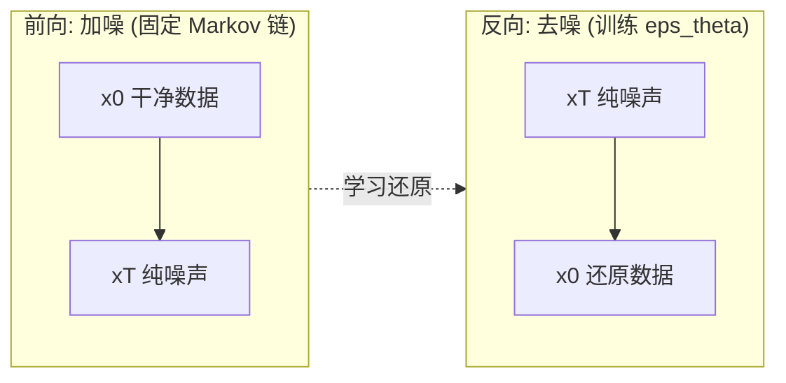
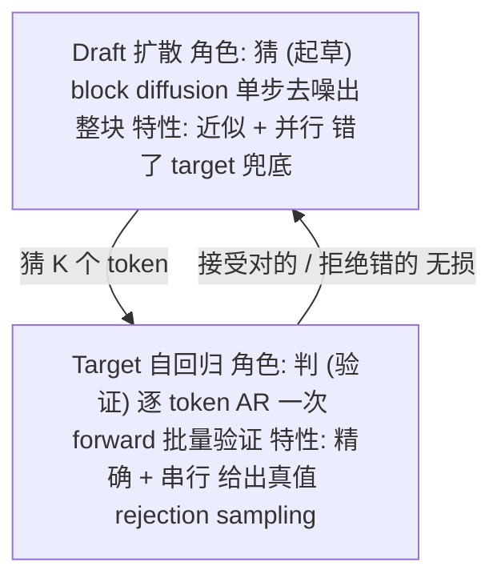
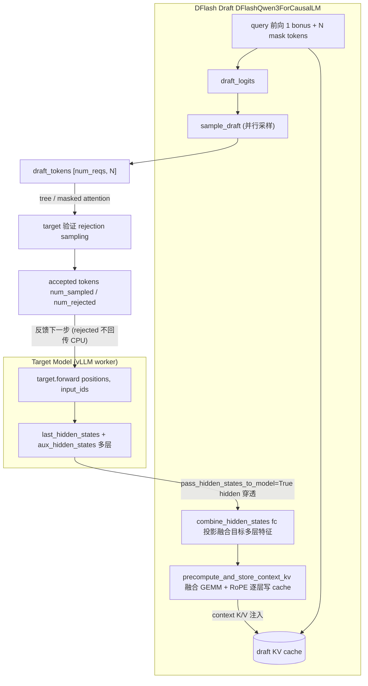
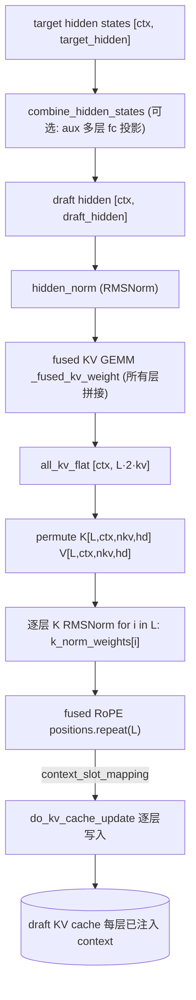
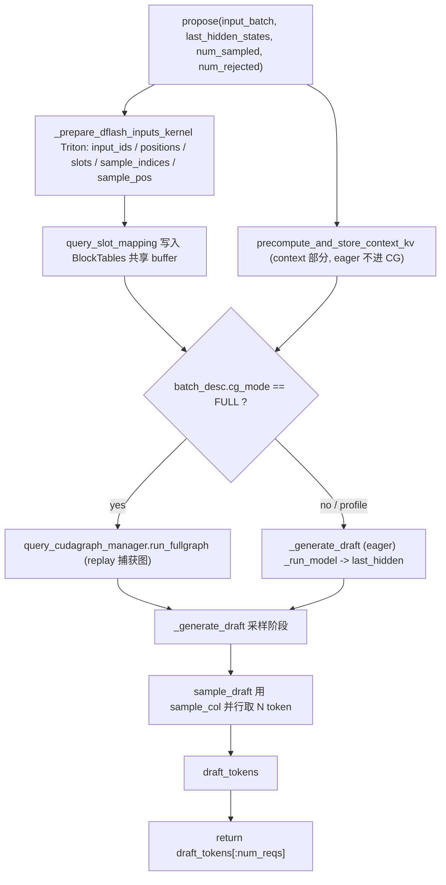
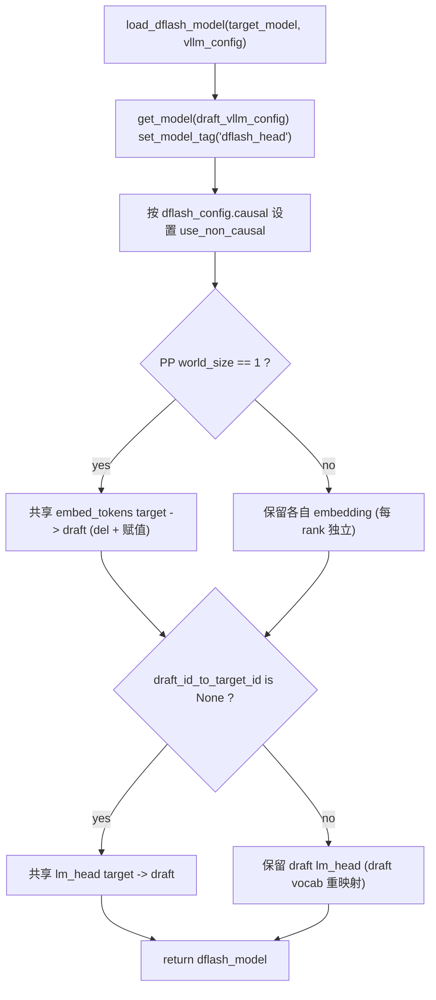

> 从扩散模型到投机解码：原理解析与代码落地 · 2026 年 6 月

## 摘要

本文围绕两个核心问题展开：(1) 什么是扩散模型，其基本原理是什么；(2) 为什么 DFlash 的 draft 模型用扩散、而 target 模型不用。在此基础上解析 DFlash 如何把扩散做到「单步前向即可用」，并落地于 vLLM 主仓的原生实现。讲解遵循「先建立扩散直觉 → 回答角色分工 → 再讲工程加速 → 最后看代码」的顺序。

## 1. 一句话定位

> **DFlash** = 用一个**轻量级 block 扩散模型**做 speculative decoding 的「起草者」，在**单次前向**内**并行**起草一整块 token，再用目标模型一次验证。本质是「**并行猜、批量判**」。

整篇围绕两个锚点问题展开：

- **Q1**：什么是扩散模型，基本原理是什么？（§3）
- **Q2**：为什么 draft 用扩散、target 不用扩散？（§4）

## 2. 背景：为什么要「并行起草」

### 2.1 LLM 自回归解码的瓶颈

大模型 decode 阶段是**严格串行**的：生成 token $N+1$ 必须等 token $N$ 出来，每出一个 token 就要跑一次完整 forward（数百 GFLOPs）。吞吐瓶颈不在算力，而在**访存与串行依赖**。

### 2.2 投机解码的通用套路

投机解码（speculative decoding）的核心思想：用**小 draft 模型**先猜 $K$ 个 token → **大 target 模型**一次 forward 批量验证 → 接受对的、拒绝错的。收益来源是「用便宜的小模型，省掉昂贵大模型的多次串行前向」。

### 2.3 现有 draft 的两类范式

| | **自回归 draft**（EAGLE/Medusa） | **扩散 draft**（DFlash） |
|---|---|---|
| 起草方式 | 逐 token 串行 | 一块 token 并行 |
| $K$ 个 token 开销 | $K$ 步（或 unroll） | 1 次前向 |
| 块内一致性 | 弱（各 token 独立） | 强（非 causal 互相关注） |

DFlash 的卖点即：**把起草从「串行」变成「一次出整块」**。

## 3. 基础：什么是扩散模型（Q1）

### 3.1 直觉：扩散 = 学怎么把噪声还原成数据

扩散模型不直接「生成」，而是学习一个**去噪过程**。分前向与反向两阶段：

- **前向（加噪）**：把干净数据 $x_0$ 一步步加噪声，最终变成纯噪声 $x_T$。连续版递推：

$$
x_t = \sqrt{1-\beta_t}\,x_{t-1} + \sqrt{\beta_t}\,\epsilon,\qquad \epsilon\sim\mathcal{N}(0,I)
$$

- **反向（去噪）**：训练一个网络 $\epsilon_\theta(x_t, t)$，从纯噪声 $x_T$ 出发，逐步去噪还原成 $x_0$。
- **训练目标**：预测每一步加的噪声，损失 $\mathcal{L}=\mathbb{E}\bigl\|\epsilon-\epsilon_\theta(x_t,t)\bigr\|^2$。



*图 1：扩散模型——前向加噪（固定）与反向去噪（学习）。*

一句话概括：**模型学会「给定一团糊的数据，猜它原本长什么样」。**

### 3.2 关键权衡：去噪步数 vs 质量 vs 速度

> 去噪步数 $T$ 越多 → 质量越高，但越慢。这正是图像扩散（Stable Diffusion）要 20~50 步、速度受限的原因。

DFlash 的破局点正在于此：**能否只用 1 步去噪？**——可以，前提是条件给得足够强（见 §5）。

### 3.3 文本/离散 token 的扩散：mask 就是「噪声」

文本是离散的，不能加高斯噪声。于是有**离散扩散**变体：

- **吸收态扩散**（absorbing diffusion / D3PM）：随机把 token 替换成 `[mask]`，前向 = 逐步 mask；去噪 = 预测被 mask 的原 token。
- **Block Diffusion**：对一整块 token 做扩散——整块先全 mask，模型一次预测整块，可部分 re-mask 再迭代。

直觉上：**BERT 的 MLM 训练，加上扩散的逐步去噪生成框架。** DFlash 用的即是 block diffusion：一块 16 个 token 全 mask → 一次去噪出整块（1 step）。

## 4. 核心设计选择：为什么 draft 用扩散、target 不用（Q2）

这是 DFlash 最关键的设计动机，从四个角度回答。



*图 2：角色分工——draft「猜」（扩散、近似、并行），target「判」（自回归、精确、串行）。*

### 4.1 角色分工：draft 是「猜」，target 是「判」

- **Draft 的任务是「猜得快」**：只要覆盖率高、批量大，猜错没关系——有 target 兜底。
- **Target 的任务是「判得准」**：必须给出精确的逐 token 条件概率 $p(x_{t+1}\mid x_{\le t})$，作为拒绝采样的真值。
- 扩散是**近似生成**，天然适合「猜」（允许误差）；不适合「判」（必须精确）。

### 4.2 无损性保证

投机解码的理论保证依赖：**target 是精确的自回归模型**，拒绝采样才能保证最终分布 = 原模型分布。若 target 自己也用扩散（近似生成）→ 没有精确真值 → 验证失去意义 → **改变输出分布（有损）**。

> **DFlash 强调 lossless**：正是因为 target 仍是原 AR 模型，draft 错的被拒、对的被接，数学上等价原模型分布。

### 4.3 效率：target 多次去噪违背初衷

投机解码的收益 = 「用便宜的小 draft 省掉昂贵大 target 的多次串行前向」。若 target 改用扩散 → target 自己要多次去噪迭代 → 每个候选块要多次大模型前向 → **比原来还慢**。Draft 体积小，即便多步扩散也便宜；target 巨大，扩散迭代代价不可承受。

### 4.4 训练成本：target 不动才是优势

- DFlash 工程卖点：**target 用现成模型，完全不动**，只训练一个轻量 draft。
- 把 target 训成扩散模型 = 要重新训练/微调一个巨型模型，成本极高。
- KV injection 让 draft 复用 target 的 hidden states——target 无须任何改动即可「指导」扩散 draft。

> **一句话总结**：扩散的「近似 + 并行」特性，正好匹配 draft「猜得快、错了能纠」的需求；而 target 必须精确、必须便宜地一次出结果，所以保持自回归。**近似给猜的人，精确给判的人。**

## 5. DFlash 如何让扩散「快到可用」

扩散模型慢在「多次去噪」。DFlash 用两个手段把它压到**单次前向**。

### 5.1 单步去噪（1 denoising step）

block size = 16，整块全 mask → 一次预测出 16 个 token。为什么 1 步就够？因为条件极强（下一节）。

### 5.2 KV Injection：把 target 的「未来信息」灌进 draft 每一层

> 论文核心洞察：大模型 hidden states **隐含了多个未来 token 的信息**。

- **不是**把 target 特征拼到 draft 输入序列——这样会随 draft 层数加深而**稀释**。
- **而是**直接注入到 draft **每一层的 K/V 投影**，让每一层都「看得见」目标上下文。
- 结果：acceptance length 随 draft 深度增长，单步去噪也能出高质量块。

### 5.3 轻量化

与 target 共享 embedding + LM head，只训练少数中间层；训练采用随机采 anchor、sparse mask 防泄漏、指数衰减 loss 优先早期 token。

## 6. 工程落地（vLLM 原生实现）

DFlash 在 vLLM 主仓是一套**端到端原生实现**，覆盖配置识别、模型注册、KV 注入草稿模型、V1/V2 双 Proposer 编排与权重共享。论文机制到代码的映射见表 1。

**表 1: 论文机制 → vLLM 实现映射**

| 论文机制 | 实现文件 | 关键符号 |
|---|---|---|
| Target Conditioning | `qwen3_dflash.py` | `combine_hidden_states`, `fc` |
| KV Injection | `qwen3_dflash.py` | `precompute_and_store_context_kv`, `_fused_kv_weight` |
| Parallel Drafting | `dflash/speculator.py` | `_generate_draft`, `_prepare_dflash_inputs_kernel` |
| 共享 embedding / LM head | `dflash/utils.py` | `load_dflash_model` |

### 6.1 端到端管线

图 3 给出一次 propose--verify 循环的数据流：target 前向得 hidden states → 穿透传给 draft → 预计算并注入 context K/V → 单次前向并行采样 $N$ 个 draft token → target 验证并返回 num_sampled/num_rejected。



*图 3：DFlash 端到端投机解码管线。*

### 6.2 配置层适配

`config/speculative.py` 识别 `method="dflash"` 并置 `parallel_drafting=True`；`algos.py` 注册 speculator、改写 HF 配置（架构 → `DFlashDraftModel`，采样层映射到 `target_layer_ids`，注意 $i-1$ 索引偏移，见 issue #40727）；`registry.py` 将架构映射到 Qwen3 族实现。目前主线仅接 Qwen3，Gemma4 / SWA 模型仍为缺口。

### 6.3 草稿模型适配：KV 注入

`precompute_and_store_context_kv`（图 4）把目标 hidden states 直接投影成 draft 每一层的 K/V 并写 cache，避免上下文随深度稀释。`_build_fused_kv_buffers` 把所有层 KV 投影权重拼成单矩阵，使「对全部层做 KV 投影」退化为**一次 GEMM**；K 的 RMSNorm 逐层算，RoPE 通过 `positions.repeat(L)` 融合成一次调用。



*图 4：KV 注入流程——融合 KV GEMM + 逐层 K 范数 + 融合 RoPE，逐层写 cache。*

```python
normed = rms_norm(context_states, self._hidden_norm_weight, eps)
all_kv_flat = F.linear(normed, self._fused_kv_weight, self._fused_kv_bias)  # 一次 GEMM
all_kv = all_kv_flat.view(num_ctx, L, 2, nkv, hd).permute(2,1,0,3,4)
all_k, all_v = all_kv[0], all_kv[1]      # [L, ctx, nkv, hd]
for i in range(L):
    ops.rms_norm(all_k_normed[i], all_k[i], self._k_norm_weights[i], eps)
ops.rotary_embedding(positions.repeat(L), all_k_flat, None, ...)  # 融合 RoPE
```

正因 context K/V 已预置 cache，`DFlashQwen3Attention.forward` 只计算 query（bonus + mask tokens）。

### 6.4 并行起草与采样编排

V2 `DFlashSpeculator.propose()`（图 5）单步逻辑：Triton kernel 准备输入 + eager 预计算 context KV + CUDA graph replay 查询前向 + 并行采样。每 request 产出 `num_query_per_req = 1 + N` 个 query token（1 bonus + N mask），mask token 用统一 `parallel_drafting_token_id` 占位。



*图 5：V2 DFlashSpeculator.propose 单步流程。*

**CUDA Graph 安全**：context/query 双 buffer 解耦，kernel 末尾按 `max_num_reqs` 补齐（sample 指向 index 0、slot 补 `PAD_SLOT_ID`），保证 replay 任意尺寸不越界。**避免 CPU–GPU 同步**：`input_ids`/`hidden_states` 始终按 target 尺寸 padding（含被拒位置），`valid_ctx_end = ctx_end - num_rejected` 在 kernel 内部算。

```python
num_sample = num_reqs * self.num_speculative_steps
sample_hidden_states = last_hidden_states[self.sample_indices[:num_sample]]
draft_tokens = self.sample_draft(
    sample_hidden_states, self.sample_pos[:num_sample],
    self.sample_idx_mapping[:num_sample], self.temperature,
    self.seeds, self.sample_col[:num_sample], self.draft_logits)
self.draft_tokens[:num_reqs] = draft_tokens.view(num_reqs, self.num_speculative_steps)
```

### 6.5 模型加载与权重共享

`load_dflash_model`（图 6）实现轻量化：PP=1 时共享 target 的 `embed_tokens`；`lm_head` 同样共享，**除非** draft 用 `draft_id_to_target_id` 做 vocab 重映射（此时保留 draft 自己的 lm_head 并散射回 target vocab）。



*图 6：load_dflash_model——embedding 与 lm_head 的条件共享。*

## 7. 对比与边界

### 7.1 DFlash vs EAGLE

- **EAGLE**：串行起草，单 token 精度高，$K$ 个 token 需 $K$ 步。
- **DFlash**：并行起草，单步出整块，吞吐更高（论文 6× vs EAGLE-3 的约 2.5× 优势）。

### 7.2 DFlash vs 完整 Block Diffusion

- **完整 BD**：多步去噪，质量高但慢。
- **DFlash**：靠 KV injection 把步数压到 1，牺牲一点精度换速度，target 验证补回精度。

### 7.3 边界与代价

> - Draft 仍是近似，acceptance 不可能 100%，存在 rejection 开销。
> - 依赖 target hidden states 可获取（需穿透传递）。
> - 单步去噪对 conditioning 强依赖 → KV injection 的实现质量直接决定效果。

## 8. 讲解节奏回顾

1. 先抛 Q1（什么是扩散）→ 建立直觉（加噪/去噪、mask 即噪声）。
2. 再抛 Q2（为什么 draft 用、target 不用）→ 用「猜 vs 判」的角色分工一击。
3. 然后讲 DFlash 如何把扩散做快（单步 + KV injection）。
4. 最后看 vLLM 工程落地。
